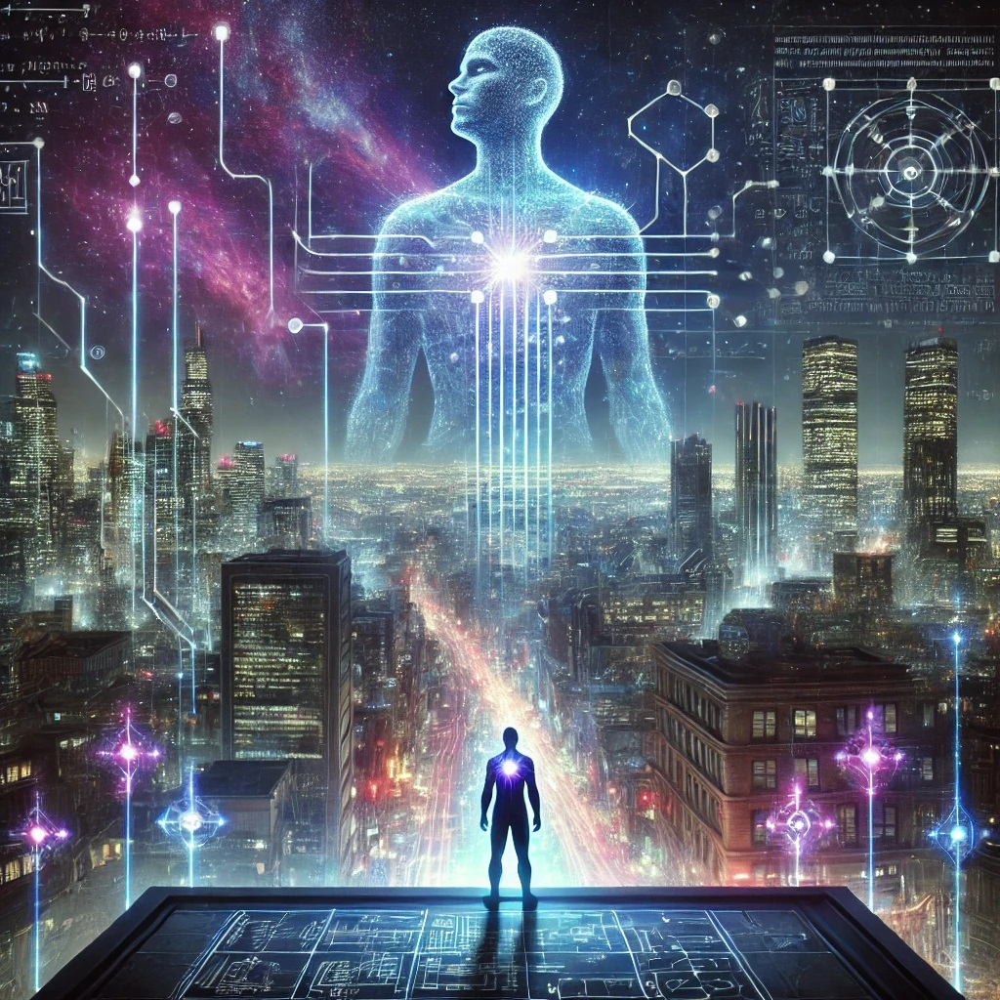

{:class="img-responsive"}

I have always been intrigued by the idea of the vital energy that moves the world and the universe. Initially, I questioned whether this universal energy could have any relation to the energy that drives us in our daily lives. Could there be a connection between the energy we need to start and complete projects and the energy that permeates the universe? And, considering that everything in the universe is governed by the laws of physics—which state that nothing is created, everything is transformed—how could this apply to our ability to overcome challenges and be more productive?

Reflecting on this, I began to consider that, as human beings, we are an integral part of the universe and, therefore, subject to the same physical laws that govern all matter and energy. Biologically, our bodies function through energy transformations: the chemical energy from the food we consume is converted into usable energy to maintain our vital functions, move muscles, and sustain brain activities. These processes obey the laws of thermodynamics, especially the law of conservation of energy.

Based on this, it seems possible that the energy we use to face personal challenges—whether starting a new project or overcoming obstacles—is a manifestation of the same forms of energy existing in the universe. When individuals achieve extraordinary performances, whether in sports or the corporate world, perhaps it is not because they possess more energy than others, but because they have learned to efficiently transform and direct the energy they have into concrete achievements.

This perspective led me to consider that the difference may lie in the management and optimization of our personal energy. High-performing individuals seem to develop an awareness of their levels of physical and mental energy, align their goals with a clear purpose, and cultivate habits that increase energy efficiency, such as good nutrition, adequate sleep, and regular exercise. Additionally, stress management techniques and mindfulness practices can contribute to conserving mental and emotional energy.

However, it is important to recognize that intensely directing our energy toward certain areas can result in imbalances in other aspects of life. Excessive focus on specific objectives can lead to burnout or neglect of personal relationships and general well-being. Therefore, sustainable management of personal energy may involve not only the pursuit of high performance but also the maintenance of a healthy balance among different areas of life.

In sum, we all have access to the same basic forms of energy. The key to increasing our achievements and overcoming challenges may lie in how we transform and direct this energy. By optimizing our internal processes and aligning our actions with our purposes, we might be able to convert the available universal energy into significant personal accomplishments, respecting the fundamental laws of physics. This journey of self-knowledge and efficient energy management could be a path for us to become more productive and fulfilled, maintaining the essential balance for a full life.